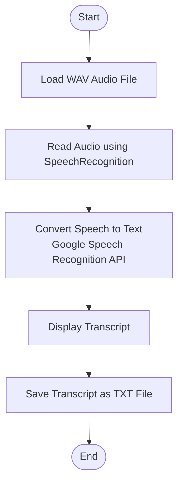

# 🎙️ Speech-to-Text Transcription


A simple Python application that converts spoken audio into text using the **SpeechRecognition** library. This project was developed as part of my **Artificial Intelligence Internship** at **Codec Technologies**, where I worked on implementing basic AI-powered applications using Python.

---

## 📖 Project Overview

Speech-to-Text Transcription is a beginner-friendly Python project that demonstrates how speech recognition technology can be used to convert audio recordings into readable text. The application reads an audio file, processes the speech using Google's Speech Recognition API through the SpeechRecognition library, and displays the transcribed text in the console. It also provides an option to save the transcription into a text file for future reference.

---

## 🎯 Objectives

- Learn the fundamentals of speech recognition in Python.
- Convert recorded speech into text.
- Understand audio file processing.
- Practice Python file handling and exception handling.
- Explore the basics of AI-powered speech processing.

---

## ✨ Features

- Convert speech from audio recordings into text.
- Supports WAV audio files.
- Uses the SpeechRecognition library.
- Displays transcription in the terminal.
- Saves the transcript to a text file.
- Handles common recognition and file-related errors.

---

## 🏗️ Project Structure

```text
speech-to-text-transcription/
│
├── audio/
│   └── sample.wav
│
├── output/
│   └── transcript.txt
│
├── main.py
├── requirements.txt
├── README.md
└── .gitignore
```

---

## 🔄 Workflow Diagram



---

## 🛠️ Technologies Used

- Python 3
- SpeechRecognition
- Google Speech Recognition API
- File Handling
- Exception Handling

---

## ⚙️ Installation

### 1. Clone the Repository

```bash
git clone https://github.com/charanepuri/speech-to-text-transcription.git
```

### 2. Navigate to the Project Folder

```bash
cd speech-to-text-transcription
```

### 3. Create a Virtual Environment (Optional)

```bash
python -m venv venv
```

Activate the environment:

**Windows**

```bash
venv\Scripts\activate
```

### 4. Install Dependencies

```bash
pip install -r requirements.txt
```

---

## ▶️ Usage

1. Place a WAV audio file inside the `audio` folder.
2. Rename it to:

```text
sample.wav
```

3. Run the application:

```bash
python main.py
```

4. The transcribed text will be displayed in the terminal and saved inside the `output` folder.

---

## 📂 Sample Output

```text
Reading audio file...
Converting speech to text...

===== Transcript =====

Hello everyone.
Welcome to my Speech-to-Text project.

Transcript saved successfully!
Location: output/transcript.txt
```

---

## 🔄 Project Workflow

```text
Audio Recording (.wav)
          │
          ▼
Read Audio File
          │
          ▼
SpeechRecognition Library
          │
          ▼
Google Speech Recognition API
          │
          ▼
Convert Speech into Text
          │
          ▼
Display Transcript
          │
          ▼
Save Transcript (.txt)
```

---

## 📚 Learning Outcomes

Through this project, I gained practical experience in:

- Speech recognition using Python
- Audio file processing
- Using external Python libraries
- Exception handling
- File operations
- Working with AI-based speech recognition APIs

---

## 💼 Internship Information

This project was developed during my **Artificial Intelligence Internship** at **Codec Technologies**.

**Internship Details**

- **Company:** Codec Technologies
- **Role:** Artificial Intelligence Intern
- **Mode:** Hybrid
- **Duration:** June 2026
- **Project Type:** Internship Project

---

## 🔗 Project Links

- GitHub Repository: [Link](https://github.com/charanepuri/speech-to-text-transcription)

---

## 👨‍💻 Author

**Charan Teja Epuri**

Aspiring Python Full Stack Developer

- GitHub: [Profile](https://github.com/charanepuri)

- Portfolio(Django): [Link](https://portfolio-site-django.onrender.com)

- LinkedIn: [Profile](https://www.linkedin.com/in/charan-teja-972aa9231)

- Portfolio(React): [Link](https://charan-react-portfolio.vercel.app)

---

## ⭐ Acknowledgements

This project was completed as part of my Artificial Intelligence Internship at **Codec Technologies**, where I explored the fundamentals of speech recognition and AI-powered audio processing using Python.
